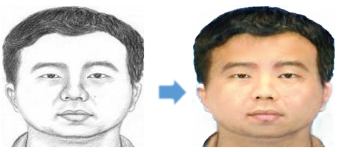

# Forensic Sketch to Face Image Transformation using CycleGAN
Given a sketch of a person, this application converts the sketch into a realistic image of the face of that person. Generating an image is challenging as it involves creating all the pixels of the image. This can be learnt if the parameters to the distribution of pixels in the image is known. In this project, GAN (Generative Adversarial Network) is used to generate images by making the model to learn the pixel distribution of images. Enhanced CycleGAN algorithm is used and the model is trained over a diverse dataset. Given an input image, it tries to generate a latent space based on many image parameters such as mean, variance, correlation between pixels and so on. This application can have use cases in forensics and art. An interactive web application is deployed over the model.

### Web Application
[sketch2face.ml](https://sketch2face.ml)

### Paper published on this project
[Forensic Sketch to Face Image Transormation Using CycleGAN](https://www.irjet.net/archives/V8/i7/IRJET-V8I7642.pdf)
